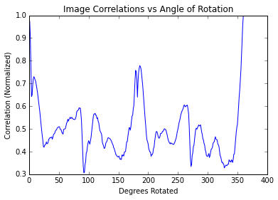
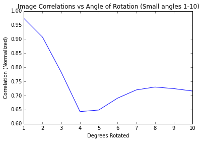
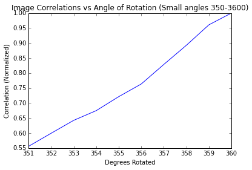

# Phash Python Bindings

Python bindings to [libphash](http://www.phash.org/).

Perceptual hashing is a method for hashing or "fingerprinting" media such as
an image or body of text in a way that is relevant to the structure of the
content. The perceptual hash of two similar images (say, one image was resized)
would be similar, unlike the cryptographic hash of the images which wouldn't
resemble the other whatsoever on account of avalanche effects.

libphash paper: http://www.phash.org/docs/pubs/thesis_zauner.pdf

## Usage

Requirements
* ImageMagick (for generating the test image set)
* libphash (for hashing, duh)

### Testing
```bash
./generate_images.sh
python test_hashing.py
```

### Demo usage
See [generate_images.sh](generate_images.sh) for how these images were created
and [test_hashing.py](test_hashing.py) for how the digests were generated.


#### Evaluating cross-correlation for scaled images

```python
test_image_correlations('scaled', is_ipython_notebook=True)
```


    md5 Digest: 0185a1e3024f4b6848ef99847af168cb
    pHash Digest: Digest(id=<python_phash.structs.LP_c_char_p object at 0x10da4fef0>, coeffs=<python_phash.structs.LP_c_byte object at 0x10da4ff80>, size=40)
    pHash DCT Hash: 5111337949474480143


    md5 Digest: 2846ea032b8d7ebd25eed967eb0a985a
    md5 Hamming Distance: 28
    pHash Digest: Digest(id=<python_phash.structs.LP_c_char_p object at 0x10da4ff80>, coeffs=<python_phash.structs.LP_c_byte object at 0x10e1f8050>, size=40)
    pHash DCT Hash: 5093323550964998175
    pHash DCT Hash Hamming Distance: 15
    Cross-correlation on Base vs. 50% scaled: 99.26%


    md5 Digest: cb950c9759c04e15fc60b0126ce3c766
    md5 Hamming Distance: 30
    pHash Digest: Digest(id=<python_phash.structs.LP_c_char_p object at 0x10da4fef0>, coeffs=<python_phash.structs.LP_c_byte object at 0x10e36c050>, size=40)
    pHash DCT Hash: 5111337949474480143
    pHash DCT Hash Hamming Distance: 0
    Cross-correlation on Base vs. 75% scaled: 99.65%


    md5 Digest: 3af6af769491b73b12ea2420d4806554
    md5 Hamming Distance: 29
    pHash Digest: Digest(id=<python_phash.structs.LP_c_char_p object at 0x10da4ff80>, coeffs=<python_phash.structs.LP_c_byte object at 0x10e36c050>, size=40)
    pHash DCT Hash: 5111337949474480143
    pHash DCT Hash Hamming Distance: 0
    Cross-correlation on Base vs. 150% scaled: 99.97%


#### Evaluating cross-correlation for blurred images

```python
test_image_correlations('blurs', is_ipython_notebook=True)
```


    md5 Digest: 0185a1e3024f4b6848ef99847af168cb
    pHash Digest: Digest(id=<python_phash.structs.LP_c_char_p object at 0x10da4fa70>, coeffs=<python_phash.structs.LP_c_byte object at 0x10da4ff80>, size=40)
    pHash DCT Hash: 5111337949474480143


    md5 Digest: 6a475196c8e6263d29fc0818257fd56e
    md5 Hamming Distance: 31
    pHash Digest: Digest(id=<python_phash.structs.LP_c_char_p object at 0x10da4ff80>, coeffs=<python_phash.structs.LP_c_byte object at 0x10e1f8050>, size=40)
    pHash DCT Hash: 5111337949474480143
    pHash DCT Hash Hamming Distance: 0
    Cross-correlation on Base vs. 2x2 blurs: 99.95%


    md5 Digest: f142a008544673d8069c65db9da8aa54
    md5 Hamming Distance: 28
    pHash Digest: Digest(id=<python_phash.structs.LP_c_char_p object at 0x10da4fa70>, coeffs=<python_phash.structs.LP_c_byte object at 0x10e36c050>, size=40)
    pHash DCT Hash: 5111337949474480143
    pHash DCT Hash Hamming Distance: 0
    Cross-correlation on Base vs. 5x2 blurs: 99.87%


    md5 Digest: 2ea848015124291fb606e845bb4455cb
    md5 Hamming Distance: 30
    pHash Digest: Digest(id=<python_phash.structs.LP_c_char_p object at 0x10da4ff80>, coeffs=<python_phash.structs.LP_c_byte object at 0x10e36c050>, size=40)
    pHash DCT Hash: 5093323550964998175
    pHash DCT Hash Hamming Distance: 15
    Cross-correlation on Base vs. 0x4 blurs: 99.43%


#### Evaluating cross-correlation for rotated images

```python
test_image_correlations('rotations', is_ipython_notebook=True)
```


    md5 Digest: 0185a1e3024f4b6848ef99847af168cb
    pHash Digest: Digest(id=<python_phash.structs.LP_c_char_p object at 0x10da4fef0>, coeffs=<python_phash.structs.LP_c_byte object at 0x10da4ff80>, size=40)
    pHash DCT Hash: 5111337949474480143


    md5 Digest: 4a80bccb3413c114828bad979ca8fc5a
    md5 Hamming Distance: 31
    pHash Digest: Digest(id=<python_phash.structs.LP_c_char_p object at 0x10da4ff80>, coeffs=<python_phash.structs.LP_c_byte object at 0x10e1f8050>, size=40)
    pHash DCT Hash: 2207722659027620709
    pHash DCT Hash Hamming Distance: 17
    Cross-correlation on Base vs. 30° rotations: 43.48%


    md5 Digest: 08e9a49387d137c8f6bbbc3d51c921c1
    md5 Hamming Distance: 27
    pHash Digest: Digest(id=<python_phash.structs.LP_c_char_p object at 0x10da4fef0>, coeffs=<python_phash.structs.LP_c_byte object at 0x10e36c050>, size=40)
    pHash DCT Hash: 5043132010545285399
    pHash DCT Hash Hamming Distance: 16
    Cross-correlation on Base vs. 10° rotations: 71.60%


    md5 Digest: 7e6284dd3b166f01cc90e7debf37f5a8
    md5 Hamming Distance: 32
    pHash Digest: Digest(id=<python_phash.structs.LP_c_char_p object at 0x10da4ff80>, coeffs=<python_phash.structs.LP_c_byte object at 0x10e36c050>, size=40)
    pHash DCT Hash: 415188508412263436
    pHash DCT Hash Hamming Distance: 16
    Cross-correlation on Base vs. 90° rotations: 40.16%


    md5 Digest: ccd638596e05504f42c65d0a6923bba9
    md5 Hamming Distance: 31
    pHash Digest: Digest(id=<python_phash.structs.LP_c_char_p object at 0x10da4fef0>, coeffs=<python_phash.structs.LP_c_byte object at 0x10e36c050>, size=40)
    pHash DCT Hash: 798627400336188661
    pHash DCT Hash Hamming Distance: 17
    Cross-correlation on Base vs. 180° rotations: 75.03%

#### Cross-correlation by image angle of rotation
```python
xx, yy = test_rotations()
%matplotlib inline
plt.plot(xx, yy)
plt.title('Image Correlations vs Angle of Rotation');
plt.xlabel('Degrees Rotated')
plt.ylabel('Correlation (Normalized)')
```



#### Cross-correlation for small angles of rotation
```python
plt.plot(xx[:10], yy[:10])
plt.title('Image Correlations vs Angle of Rotation (Small angles 1-10)');
plt.xlabel('Degrees Rotated')
plt.ylabel('Correlation (Normalized)')
```


```python
plt.plot(xx[-10:], yy[-10:])
plt.title('Image Correlations vs Angle of Rotation (Small angles 350-3600)');
plt.xlabel('Degrees Rotated')
plt.ylabel('Correlation (Normalized)')
```



# TODO:
* Include textual hash functions in python bindings
* Include setup.py to make this package redistributable
